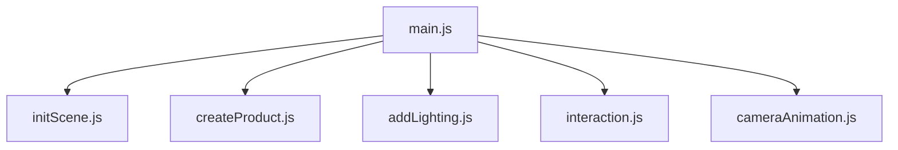

# 🪑 3D Product Viewer - Interactive Chair Configurator

## 📸 Preview


A responsive Three.js application that demonstrates interactive 3D product visualization using basic geometries. Built as part of a computer graphics assignment.

## ✨ Features

### Core Requirements
✅ **Scene Setup**  
- PerspectiveCamera with OrbitControls  
- Responsive WebGLRenderer  
- Auto-resizing on window changes  

✅ **Product Modeling**  
- Chair constructed from primitive geometries (Boxes, Cylinders)  
- MeshStandardMaterial for realistic lighting  
- Centered at world origin (0,0,0)  

✅ **Lighting System**  
- Ambient light for base illumination  
- Directional light with shadows  
- Strategic light positioning  

✅ **Interactions**  
- Raycasting for part selection  
- Visual feedback on hover/click  
- Dynamic info panel showing part details  

✅ **Camera Animation**  
- Smooth auto-rotation around Y-axis  
- Manual control override  
- Adjustable rotation speed  

### Bonus Features
🔹 Mobile-responsive UI  
🔹 Loading screen with spinner  
🔹 Fullscreen mode toggle  

## 🛠️ Technical Implementation



**Key Dependencies:**
- Three.js
- OrbitControls
- Font Awesome Icons

## 🚀 Setup

1. Clone repository:
   ```bash
   git clone https://github.com/natnaeleyuel/3d-product-viewer.git
   ```
2. Install dependencies:
   ```bash
   npm install three
   ```
3. Open `index.html` in browser

## 🎮 Usage

1. **Rotate**: Left-click + drag  
2. **Zoom**: Scroll wheel  
3. **Pan**: Right-click + drag  
4. **Select Parts**: Click on any chair component  
5. **Toggle Auto-Rotate**: Click 🔄 button  

## 📚 Learning Outcomes

- Mastered Three.js scene composition
- Implemented advanced raycasting
- Developed modular JavaScript architecture
- Solved 3D lighting challenges
- Created responsive WebGL experiences

## 🌟 Future Enhancements

- [ ] Texture mapping
- [ ] Multi-product selector
- [ ] AR preview mode
- [ ] Custom color picker

**Developed by Natnael Eyuel**  
